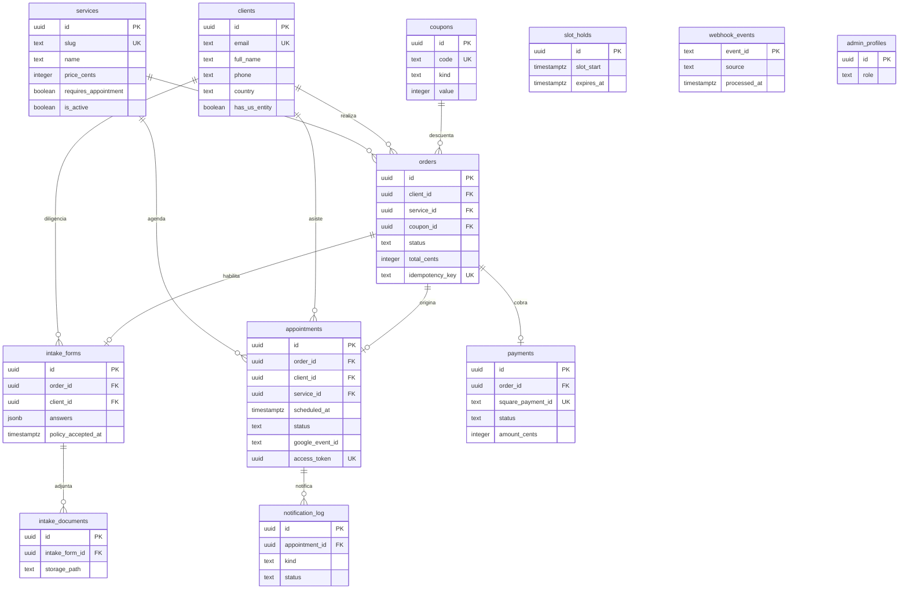

# Esquema de Base de Datos — Leos Firm LLC

**Base de datos:** Supabase (PostgreSQL 15)
**Última actualización:** 2026-08-02 · **Estado global:** DISEÑADO — ninguna migración aplicada todavía

> ⚠️ **Importante:** este documento describe el modelo **diseñado** en FASE 1. Las tablas se crean
> durante FASE 2, una por feature, con su migración correspondiente. Cada vez que se cree una tabla
> real hay que actualizar aquí su estado a `Aplicada` y registrar la migración al final.
> **Mandamiento V:** ningún cambio de schema existe sin actualizar este archivo.

---

## Diagrama ER



---

## Índice de Tablas

| # | Tabla | Descripción | RLS | Estado |
|---|-------|-------------|-----|--------|
| 1 | [`services`](#services) | Catálogo de servicios y precios | SÍ | Diseñada |
| 2 | [`clients`](#clients) | CRM — personas y empresas | SÍ | Diseñada |
| 3 | [`orders`](#orders) | Órdenes de compra | SÍ | Diseñada |
| 4 | [`payments`](#payments) | Pagos de Square | SÍ | Diseñada |
| 5 | [`coupons`](#coupons) | Cupones (referidos, 30 min gratis) | SÍ | Diseñada |
| 6 | [`intake_forms`](#intake_forms) | Formulario de ingreso | SÍ | Diseñada |
| 7 | [`intake_documents`](#intake_documents) | Adjuntos del intake | SÍ | Diseñada |
| 8 | [`appointments`](#appointments) | Citas agendadas | SÍ | Diseñada |
| 9 | [`slot_holds`](#slot_holds) | Bloqueo temporal de slots | SÍ | Diseñada |
| 10 | [`notification_log`](#notification_log) | Correos enviados / reintentos | SÍ | Diseñada |
| 11 | [`webhook_events`](#webhook_events) | Idempotencia de webhooks | SÍ | Diseñada |
| 12 | [`admin_profiles`](#admin_profiles) | Roles del panel admin | SÍ | Diseñada |

---

## Tipos Enumerados

```sql
CREATE TYPE order_status AS ENUM (
  'pending',      -- creada, sin pagar
  'paid',         -- webhook de Square confirmó el pago
  'failed',       -- pago rechazado
  'refunded',     -- reembolsada (política de cancelación)
  'cancelled'     -- anulada antes de pagar
);

CREATE TYPE appointment_status AS ENUM (
  'pendiente_atencion',  -- agendada y pagada, aún no ocurre
  'atendido',            -- la cita se cumplió
  'reprogramada',        -- movida (≥24h de anticipación)
  'cancelada',           -- cancelada por cliente o por la firma
  'no_show'              -- el cliente no se presentó (no reembolsable)
);

CREATE TYPE meeting_provider AS ENUM ('google_meet', 'zoom');

CREATE TYPE notification_kind AS ENUM (
  'appointment_confirmation',   -- al cliente
  'admin_notification',         -- copia a Claudia
  'reminder_24h',
  'reminder_1h',
  'reschedule_confirmation',
  'cancellation_confirmation',
  'post_meeting_summary'        -- resumen IA
);

CREATE TYPE notification_status AS ENUM ('pending', 'sent', 'failed');

CREATE TYPE coupon_kind AS ENUM (
  'percent',        -- descuento porcentual
  'fixed',          -- descuento en centavos
  'free_minutes'    -- primeros N minutos gratis (referidos de abogados)
);
```

---

## Tablas

### services

> Catálogo de servicios. **El precio siempre se lee de aquí en el servidor** (ADR-006); el cliente
> nunca envía montos.

| Columna | Tipo | Nullable | Default | Descripción |
|---------|------|----------|---------|-------------|
| `id` | `uuid` | NO | `gen_random_uuid()` | PK |
| `slug` | `text` | NO | — | Identificador de URL (`consultoria-fiscal`) |
| `name` | `text` | NO | — | Nombre visible |
| `short_description` | `text` | NO | — | Texto de la tarjeta del catálogo |
| `long_description` | `text` | SÍ | `null` | Detalle de la página del servicio |
| `price_cents` | `integer` | SÍ | `null` | Precio en centavos USD. `null` = requiere cotización |
| `currency` | `text` | NO | `'USD'` | ISO 4217 |
| `duration_minutes` | `integer` | SÍ | `null` | Duración de la cita, si aplica |
| `requires_appointment` | `boolean` | NO | `true` | Si dispara el flujo de agendamiento |
| `is_subscription` | `boolean` | NO | `false` | Bookkeeping / payroll (cobro recurrente) |
| `intake_schema_key` | `text` | SÍ | `null` | Qué variante de intake usar |
| `display_order` | `integer` | NO | `0` | Orden en el catálogo |
| `is_active` | `boolean` | NO | `true` | Visible al público |
| `created_at` | `timestamptz` | NO | `now()` | — |
| `updated_at` | `timestamptz` | NO | `now()` | — |

**Constraints:** `UNIQUE (slug)` · `CHECK (price_cents IS NULL OR price_cents >= 0)` ·
`CHECK (NOT requires_appointment OR duration_minutes IS NOT NULL)`

**RLS:**
```sql
ALTER TABLE services ENABLE ROW LEVEL SECURITY;

-- Único acceso público de todo el schema: leer el catálogo activo
CREATE POLICY "services_public_read" ON services
  FOR SELECT TO anon, authenticated USING (is_active = true);

-- La escritura queda solo para service_role (bypassa RLS) y admins
CREATE POLICY "services_admin_all" ON services
  FOR ALL TO authenticated
  USING (EXISTS (SELECT 1 FROM admin_profiles p WHERE p.id = auth.uid()))
  WITH CHECK (EXISTS (SELECT 1 FROM admin_profiles p WHERE p.id = auth.uid()));
```

---

### clients

> El CRM. Un cliente se crea o se reutiliza por email en el momento del checkout. No tiene cuenta
> de usuario (ADR-001).

| Columna | Tipo | Nullable | Default | Descripción |
|---------|------|----------|---------|-------------|
| `id` | `uuid` | NO | `gen_random_uuid()` | PK |
| `email` | `text` | NO | — | Identificador natural, normalizado a minúsculas |
| `full_name` | `text` | NO | — | Nombre completo |
| `phone` | `text` | SÍ | `null` | Formato E.164 |
| `country` | `text` | SÍ | `null` | País de residencia (ISO 3166-1 alpha-2) |
| `timezone` | `text` | SÍ | `null` | Huso horario detectado del navegador |
| `has_us_entity` | `boolean` | SÍ | `null` | ¿Ya tiene LLC/INC? (`context.md` §7) |
| `entity_state` | `text` | SÍ | `null` | Estado de registro de la entidad |
| `entity_activity` | `text` | SÍ | `null` | Objeto social |
| `entity_age` | `text` | SÍ | `null` | Antigüedad de la entidad |
| `source` | `text` | SÍ | `null` | `web`, `referral_lawyer`, `manual` |
| `referred_by` | `text` | SÍ | `null` | Abogado o socio que refirió |
| `notes` | `text` | SÍ | `null` | Notas internas del CRM |
| `created_at` | `timestamptz` | NO | `now()` | — |
| `updated_at` | `timestamptz` | NO | `now()` | — |

**Constraints:** `UNIQUE (email)` · `CHECK (email = lower(email))`
**Índices:** `clients_email_idx (email)` · `clients_created_at_idx (created_at DESC)`

**RLS:** contiene PII → **sin acceso anónimo**.
```sql
ALTER TABLE clients ENABLE ROW LEVEL SECURITY;

CREATE POLICY "clients_admin_all" ON clients
  FOR ALL TO authenticated
  USING (EXISTS (SELECT 1 FROM admin_profiles p WHERE p.id = auth.uid()))
  WITH CHECK (EXISTS (SELECT 1 FROM admin_profiles p WHERE p.id = auth.uid()));
-- El flujo público escribe vía service_role desde Route Handlers.
```

---

### orders

> Una orden por intento de compra. Nace en `pending` y **solo el webhook de Square** la pasa a
> `paid` (ADR-002).

| Columna | Tipo | Nullable | Default | Descripción |
|---------|------|----------|---------|-------------|
| `id` | `uuid` | NO | `gen_random_uuid()` | PK |
| `client_id` | `uuid` | NO | — | FK → `clients(id)` |
| `service_id` | `uuid` | NO | — | FK → `services(id)` |
| `coupon_id` | `uuid` | SÍ | `null` | FK → `coupons(id)` |
| `status` | `order_status` | NO | `'pending'` | Estado del cobro |
| `subtotal_cents` | `integer` | NO | — | Precio del servicio al momento de la compra |
| `discount_cents` | `integer` | NO | `0` | Descuento aplicado |
| `total_cents` | `integer` | NO | — | Monto realmente cobrado |
| `currency` | `text` | NO | `'USD'` | — |
| `idempotency_key` | `text` | NO | — | Enviado a Square; evita cobros duplicados |
| `square_order_id` | `text` | SÍ | `null` | Id de orden en Square |
| `paid_at` | `timestamptz` | SÍ | `null` | Cuando el webhook confirmó |
| `created_at` | `timestamptz` | NO | `now()` | — |
| `updated_at` | `timestamptz` | NO | `now()` | — |

**Constraints:** `UNIQUE (idempotency_key)` ·
`CHECK (total_cents = subtotal_cents - discount_cents)` · `CHECK (total_cents >= 0)`
**FK:** `client_id` → `clients(id)` `ON DELETE RESTRICT` · `service_id` → `services(id)` `ON DELETE RESTRICT`
**Índices:** `orders_client_idx (client_id)` · `orders_status_idx (status)` · `orders_square_order_idx (square_order_id)`

> `ON DELETE RESTRICT` es intencional: una orden pagada es un registro contable, no se borra en
> cascada al limpiar un cliente.

**RLS:** igual que `clients` (solo admin + service_role).

---

### payments

> Registro del cobro de Square. **Nunca** guarda datos de tarjeta (`03-security.md`).

| Columna | Tipo | Nullable | Default | Descripción |
|---------|------|----------|---------|-------------|
| `id` | `uuid` | NO | `gen_random_uuid()` | PK |
| `order_id` | `uuid` | NO | — | FK → `orders(id)` |
| `square_payment_id` | `text` | NO | — | Id del pago en Square |
| `status` | `text` | NO | — | `APPROVED`, `COMPLETED`, `FAILED`, `CANCELED` |
| `amount_cents` | `integer` | NO | — | Monto cobrado |
| `currency` | `text` | NO | `'USD'` | — |
| `card_brand` | `text` | SÍ | `null` | `VISA`, `MASTERCARD`… (solo soporte) |
| `card_last4` | `text` | SÍ | `null` | Últimos 4 dígitos (solo soporte) |
| `receipt_url` | `text` | SÍ | `null` | Recibo de Square |
| `refunded_cents` | `integer` | NO | `0` | Total reembolsado |
| `raw_event` | `jsonb` | SÍ | `null` | Payload del webhook, sin PII de tarjeta |
| `created_at` | `timestamptz` | NO | `now()` | — |

**Constraints:** `UNIQUE (square_payment_id)` · `CHECK (card_last4 IS NULL OR length(card_last4) = 4)`
**FK:** `order_id` → `orders(id)` `ON DELETE RESTRICT`

---

### coupons

> Soporta los **primeros 30 minutos gratis** para referidos de abogados de inmigración
> (`context.md` §6).

| Columna | Tipo | Nullable | Default | Descripción |
|---------|------|----------|---------|-------------|
| `id` | `uuid` | NO | `gen_random_uuid()` | PK |
| `code` | `text` | NO | — | Código, en mayúsculas |
| `kind` | `coupon_kind` | NO | — | `percent` · `fixed` · `free_minutes` |
| `value` | `integer` | NO | — | % · centavos · minutos, según `kind` |
| `service_id` | `uuid` | SÍ | `null` | Limitar a un servicio |
| `max_redemptions` | `integer` | SÍ | `null` | `null` = ilimitado |
| `redemptions` | `integer` | NO | `0` | Usos consumidos |
| `valid_from` | `timestamptz` | SÍ | `null` | — |
| `valid_until` | `timestamptz` | SÍ | `null` | — |
| `is_active` | `boolean` | NO | `true` | — |
| `created_at` | `timestamptz` | NO | `now()` | — |

**Constraints:** `UNIQUE (code)` · `CHECK (code = upper(code))` · `CHECK (value >= 0)` ·
`CHECK (max_redemptions IS NULL OR redemptions <= max_redemptions)`

> La validación del cupón ocurre **en el servidor**. Nunca exponer la tabla al público: un
> `SELECT` anónimo permitiría enumerar todos los códigos.

---

### intake_forms

> Formulario de ingreso (`context.md` §7). Se habilita **después** de que la orden está `paid`.

| Columna | Tipo | Nullable | Default | Descripción |
|---------|------|----------|---------|-------------|
| `id` | `uuid` | NO | `gen_random_uuid()` | PK |
| `order_id` | `uuid` | NO | — | FK → `orders(id)` |
| `client_id` | `uuid` | NO | — | FK → `clients(id)` |
| `schema_key` | `text` | NO | — | Variante de formulario usada |
| `answers` | `jsonb` | NO | `'{}'` | Respuestas (estructura condicional) |
| `ai_generated_schema` | `jsonb` | SÍ | `null` | Preguntas que generó el agente IA |
| `ai_validation` | `jsonb` | SÍ | `null` | Observaciones de la validación semántica |
| `consultation_reason` | `text` | SÍ | `null` | Motivo (cuando NO tiene entidad en EE. UU.) |
| `policy_accepted` | `boolean` | NO | `false` | Aceptación de la política de cancelación |
| `policy_accepted_at` | `timestamptz` | SÍ | `null` | Evidencia — timestamp |
| `policy_accepted_ip` | `inet` | SÍ | `null` | Evidencia — IP |
| `is_complete` | `boolean` | NO | `false` | Pasó la validación |
| `created_at` | `timestamptz` | NO | `now()` | — |
| `updated_at` | `timestamptz` | NO | `now()` | — |

**Constraints:** `UNIQUE (order_id)` ·
`CHECK (NOT is_complete OR (policy_accepted AND policy_accepted_at IS NOT NULL))`

> Ese `CHECK` es la garantía a nivel de base de datos de la regla de negocio §8.9: **no puede
> existir un intake completo sin aceptación registrada de la política de cancelación.**

---

### intake_documents

> Adjuntos del intake. El archivo vive en Supabase Storage (bucket **privado**
> `intake-documents`); aquí solo la referencia.

| Columna | Tipo | Nullable | Default | Descripción |
|---------|------|----------|---------|-------------|
| `id` | `uuid` | NO | `gen_random_uuid()` | PK |
| `intake_form_id` | `uuid` | NO | — | FK → `intake_forms(id)` `ON DELETE CASCADE` |
| `storage_path` | `text` | NO | — | Ruta en el bucket |
| `file_name` | `text` | NO | — | Nombre original |
| `mime_type` | `text` | NO | — | Tipo MIME validado en el servidor |
| `size_bytes` | `integer` | NO | — | Máximo 10 MB |
| `created_at` | `timestamptz` | NO | `now()` | — |

**Constraints:** `CHECK (size_bytes > 0 AND size_bytes <= 10485760)`

**Política de Storage:** el bucket es privado. La descarga se hace **solo** con signed URL generada
por el servidor (≤ 15 min). Nunca hacer público el bucket.

---

### appointments

> La cita. Espejo local del evento de Google Calendar, que es la fuente de verdad (ADR-003).

| Columna | Tipo | Nullable | Default | Descripción |
|---------|------|----------|---------|-------------|
| `id` | `uuid` | NO | `gen_random_uuid()` | PK |
| `order_id` | `uuid` | SÍ | — | FK → `orders(id)`. `null` solo en citas manuales del admin |
| `client_id` | `uuid` | NO | — | FK → `clients(id)` |
| `service_id` | `uuid` | NO | — | FK → `services(id)` |
| `status` | `appointment_status` | NO | `'pendiente_atencion'` | Estado operativo |
| `scheduled_at` | `timestamptz` | NO | — | Inicio, **siempre en UTC** |
| `ends_at` | `timestamptz` | NO | — | Fin |
| `client_timezone` | `text` | SÍ | `null` | Huso del cliente, para mostrar y para los correos |
| `google_event_id` | `text` | SÍ | `null` | Id del evento en Calendar |
| `meeting_provider` | `meeting_provider` | NO | `'google_meet'` | — |
| `meeting_url` | `text` | SÍ | `null` | Enlace de Meet/Zoom |
| `access_token` | `uuid` | NO | `gen_random_uuid()` | Token del enlace del cliente (ADR-001) |
| `rescheduled_from` | `uuid` | SÍ | `null` | FK → `appointments(id)` (autorreferencia) |
| `cancelled_at` | `timestamptz` | SÍ | `null` | — |
| `cancellation_reason` | `text` | SÍ | `null` | — |
| `attended_at` | `timestamptz` | SÍ | `null` | Cuándo pasó a `atendido` |
| `ai_summary` | `text` | SÍ | `null` | Resumen post-cita generado por IA |
| `admin_notes` | `text` | SÍ | `null` | Notas internas |
| `created_at` | `timestamptz` | NO | `now()` | — |
| `updated_at` | `timestamptz` | NO | `now()` | — |

**Constraints:** `UNIQUE (access_token)` · `UNIQUE (google_event_id)` · `CHECK (ends_at > scheduled_at)`
**Índices:** `appointments_scheduled_idx (scheduled_at)` · `appointments_status_idx (status)` ·
`appointments_client_idx (client_id)` · `appointments_access_token_idx (access_token)`

**Anti doble-reserva (defensa en profundidad):**
```sql
-- Impide dos citas activas solapadas, incluso si Google Calendar responde tarde
CREATE EXTENSION IF NOT EXISTS btree_gist;
ALTER TABLE appointments ADD CONSTRAINT appointments_no_overlap
  EXCLUDE USING gist (
    tstzrange(scheduled_at, ends_at) WITH &&
  ) WHERE (status IN ('pendiente_atencion', 'atendido'));
```

**RLS:** sin acceso anónimo. El cliente accede a **su** cita solo a través de endpoints del servidor
que validan el `access_token`; el token nunca se usa como credencial de Postgres.

---

### slot_holds

> Bloqueo temporal del slot mientras el cliente completa el intake. Evita que dos personas tomen el
> mismo horario a la vez (ADR-003).

| Columna | Tipo | Nullable | Default | Descripción |
|---------|------|----------|---------|-------------|
| `id` | `uuid` | NO | `gen_random_uuid()` | PK |
| `order_id` | `uuid` | SÍ | `null` | FK → `orders(id)` |
| `slot_start` | `timestamptz` | NO | — | Inicio del slot reservado |
| `slot_end` | `timestamptz` | NO | — | Fin |
| `expires_at` | `timestamptz` | NO | `now() + interval '10 minutes'` | TTL del bloqueo |
| `created_at` | `timestamptz` | NO | `now()` | — |

**Índices:** `slot_holds_expires_idx (expires_at)` · `slot_holds_slot_idx (slot_start)`
Los holds vencidos se limpian en el cron de mantenimiento.

---

### notification_log

> Toda notificación enviada, con su estado. Permite reintentar sin duplicar y auditar qué recibió
> el cliente.

| Columna | Tipo | Nullable | Default | Descripción |
|---------|------|----------|---------|-------------|
| `id` | `uuid` | NO | `gen_random_uuid()` | PK |
| `appointment_id` | `uuid` | SÍ | `null` | FK → `appointments(id)` `ON DELETE CASCADE` |
| `order_id` | `uuid` | SÍ | `null` | FK → `orders(id)` |
| `kind` | `notification_kind` | NO | — | Tipo de correo |
| `recipient` | `text` | NO | — | Destinatario |
| `status` | `notification_status` | NO | `'pending'` | — |
| `provider_message_id` | `text` | SÍ | `null` | Id de Gmail |
| `error` | `text` | SÍ | `null` | Motivo del fallo |
| `attempts` | `integer` | NO | `0` | Reintentos |
| `sent_at` | `timestamptz` | SÍ | `null` | — |
| `created_at` | `timestamptz` | NO | `now()` | — |

**Constraints:** `UNIQUE (appointment_id, kind)` — un recordatorio de 24 h se envía **una sola vez**
por cita.

---

### webhook_events

> Idempotencia y anti-replay de webhooks (`03-security.md`).

| Columna | Tipo | Nullable | Default | Descripción |
|---------|------|----------|---------|-------------|
| `event_id` | `text` | NO | — | PK — id del evento del proveedor |
| `source` | `text` | NO | `'square'` | Proveedor |
| `event_type` | `text` | NO | — | `payment.updated`, … |
| `payload` | `jsonb` | SÍ | `null` | Cuerpo recibido |
| `processed_at` | `timestamptz` | NO | `now()` | — |

Si el `event_id` ya existe → responder `200 OK` sin reprocesar.

---

### admin_profiles

> Extiende `auth.users` con el rol. Solo para el panel administrativo.

| Columna | Tipo | Nullable | Default | Descripción |
|---------|------|----------|---------|-------------|
| `id` | `uuid` | NO | — | PK, FK → `auth.users(id)` `ON DELETE CASCADE` |
| `full_name` | `text` | SÍ | `null` | — |
| `role` | `text` | NO | `'admin'` | `admin` · `staff` |
| `created_at` | `timestamptz` | NO | `now()` | — |

```sql
CREATE POLICY "admin_profiles_self_read" ON admin_profiles
  FOR SELECT TO authenticated USING (id = auth.uid());
```

---

## Funciones y Triggers

### handle_updated_at()

```sql
CREATE OR REPLACE FUNCTION handle_updated_at()
RETURNS TRIGGER
LANGUAGE plpgsql
SECURITY INVOKER
SET search_path = ''
AS $$
BEGIN
  NEW.updated_at = now();
  RETURN NEW;
END;
$$;
```

Aplicar como `BEFORE UPDATE` en: `services`, `clients`, `orders`, `intake_forms`, `appointments`.

> `SET search_path = ''` y `SECURITY INVOKER` son obligatorios: son la recomendación de los
> advisors de seguridad de Supabase para evitar secuestro de `search_path`.

---

## Resumen RLS

| Tabla | anon SELECT | admin (authenticated) | Flujo público |
|-------|-------------|----------------------|---------------|
| `services` | ✅ solo `is_active` | ALL | lectura directa |
| `clients` | ❌ | ALL | vía `service_role` |
| `orders` | ❌ | ALL | vía `service_role` |
| `payments` | ❌ | SELECT | vía `service_role` |
| `coupons` | ❌ | ALL | validación en servidor |
| `intake_forms` | ❌ | ALL | vía `service_role` |
| `intake_documents` | ❌ | SELECT | signed URL del servidor |
| `appointments` | ❌ | ALL | vía `service_role` + `access_token` |
| `slot_holds` | ❌ | SELECT | vía `service_role` |
| `notification_log` | ❌ | SELECT | vía `service_role` |
| `webhook_events` | ❌ | ❌ | solo `service_role` |
| `admin_profiles` | ❌ | SELECT propio | — |

**Regla:** la única tabla con lectura anónima en todo el schema es `services`.

---

## Datos Semilla (`services`)

Fuente: `context.md` §5. Los precios de cotización van con `price_cents = NULL`.

| slug | name | price_cents | duration | requires_appointment |
|------|------|-------------|----------|---------------------|
| `consultoria-fiscal-extranjeros` | Consultoría fiscal para empresarios extranjeros | `15000` | 60 | ✅ |
| `elecciones-fiscales` | Elecciones fiscales | `25000` | — | ❌ |
| `apertura-llc-soft-landing` | Apertura y estructuración de LLC / Corporation | `NULL` | 60 | ✅ |
| `bookkeeping` | Bookkeeping y reportes financieros | `NULL` | 60 | ✅ |
| `payroll` | Payroll (nómina) | `NULL` | 60 | ✅ |
| `sales-tax` | Sales Tax y cumplimiento estatal | `NULL` | 60 | ✅ |
| `regularizacion-empresas` | Regularización de empresas existentes | `NULL` | 60 | ✅ |
| `expansion-usa` | Expansión de empresas extranjeras a EE. UU. | `NULL` | 60 | ✅ |

---

## Historial de Migraciones

| # | Archivo | Fecha | Descripción | Estado |
|---|---------|-------|-------------|--------|
| — | — | — | _Ninguna migración aplicada. Se crean en FASE 2, una por feature._ | — |

---

## Tipos TypeScript

Se generan desde el proyecto enlazado y **no se editan a mano**:

```bash
supabase gen types typescript --linked > src/types/database.types.ts
```

Regenerar después de **cada** migración (Mandamiento V + IX).
